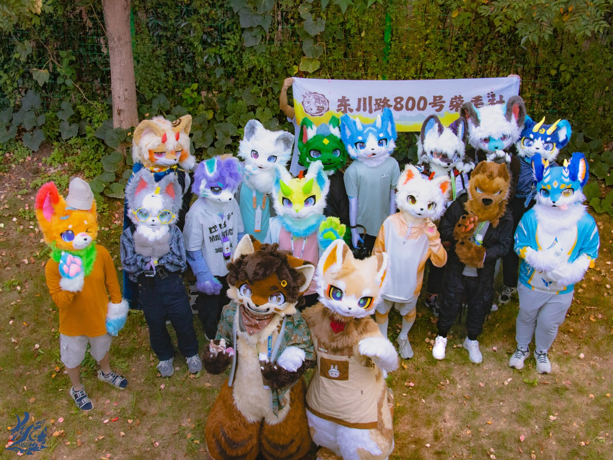
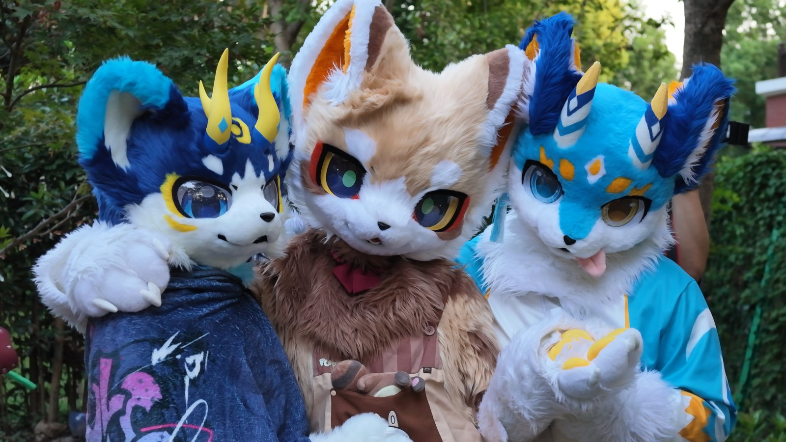
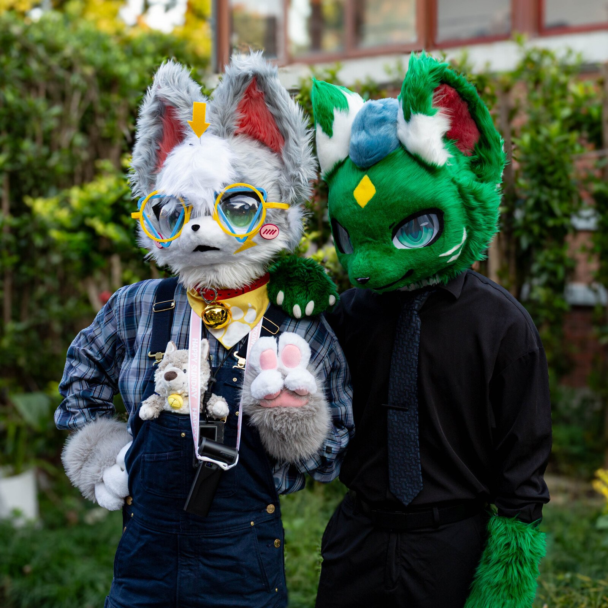
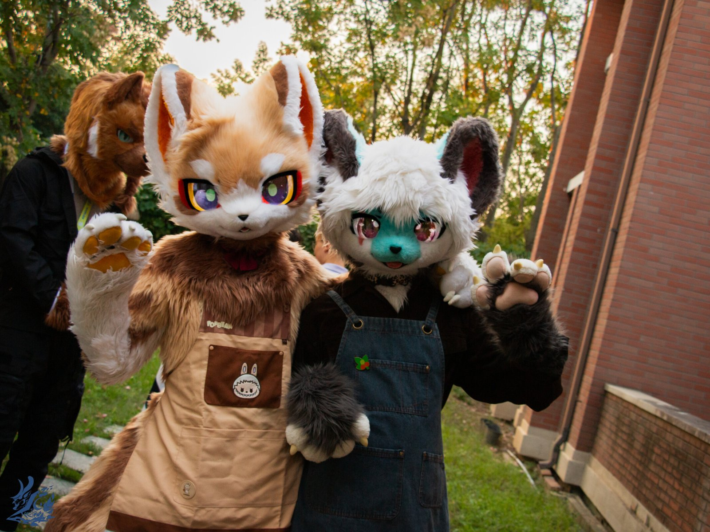
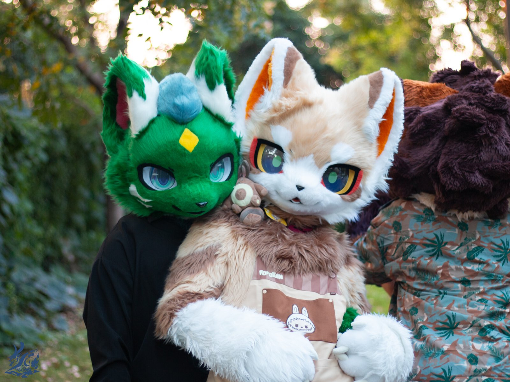
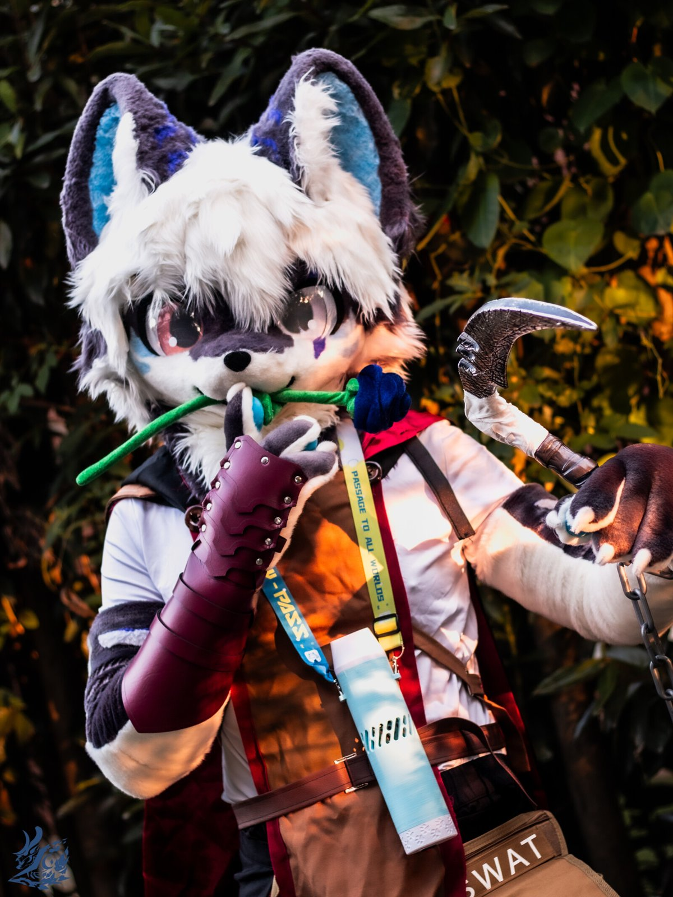
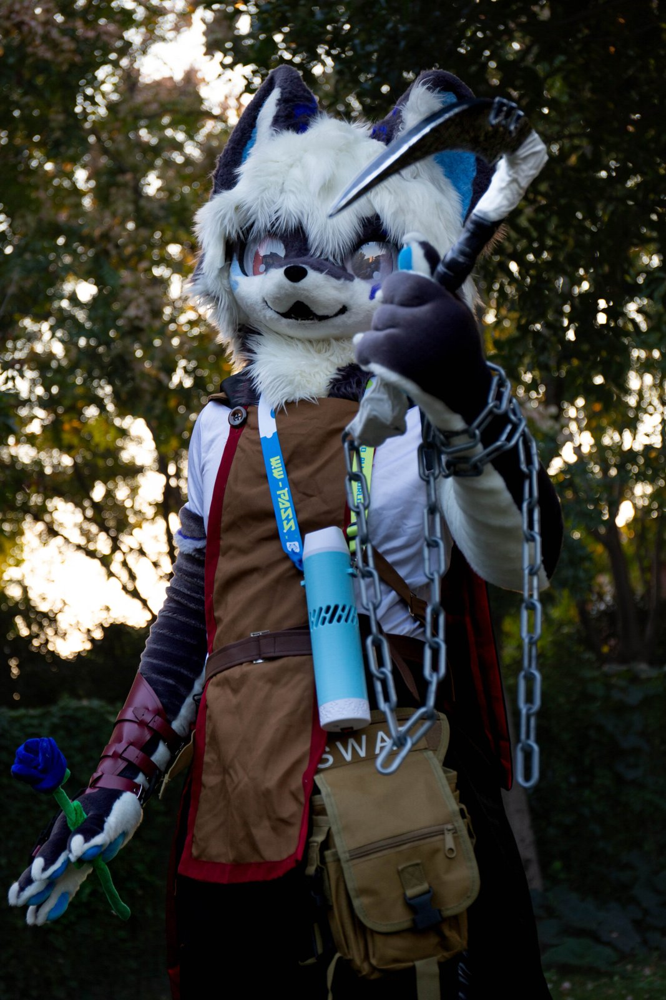
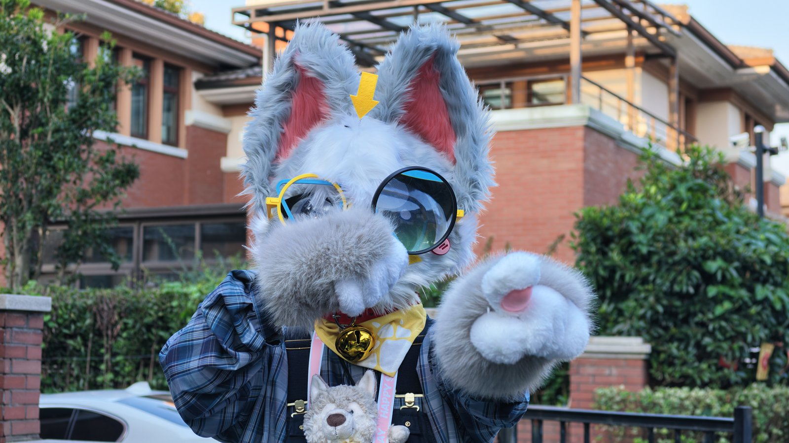

国庆假期，社团的群友们齐聚闵行校区附近的一家轰趴馆，迎来了 2026 年的国庆荣兽聚。本次活动为期两天一夜，共约 40 位群友参加，采用群成员邀请制。轰趴馆内有桌游、KTV、台球、游戏机等设施，屋外还有小草坪，供大家出毛、拍照和游玩。

## Day 1｜10 月 6 日

下午大家陆续到场签到、放置行李并简单熟悉场地。随后进入分组破冰环节：极限二选一、社交 Bingo、传球记名……一群原本陌生的毛毛很快就熟络了起来。

破冰结束后，大家换装出毛，在草坪上集合走秀、自由拍照互动，并拍摄了全员大合照。

傍晚收毛休整后，大家一起享用晚餐。饭后还进行了问答游戏和蒙眼捉迷藏，笑声不断。夜深之后，桌游、KTV、台球区依旧热闹非凡。

## Day 2｜10 月 7 日

第二天上午是自由活动时间：睡觉补眠、桌游开黑、聊天拍照，各得其所。午后正式进入团体竞技环节，各组沿用前一天的分组展开积分混战——海绵桥石头剪刀布、背筐接球、弹球进杯、比手画脚等游戏轮番上阵，胜负难分。

竞技结束后，根据两天的总积分颁发了小组奖项，大家再次合影留念。晚餐之后，活动正式落下帷幕，工作人员完成场地整理，伙伴们陆续离场。

## 写在最后

感谢每一位到场的小伙伴，也感谢忙前忙后的工作人员。出毛、游戏、合照、欢笑——这就是荣毛社的假期打开方式。期待下一次相聚！
